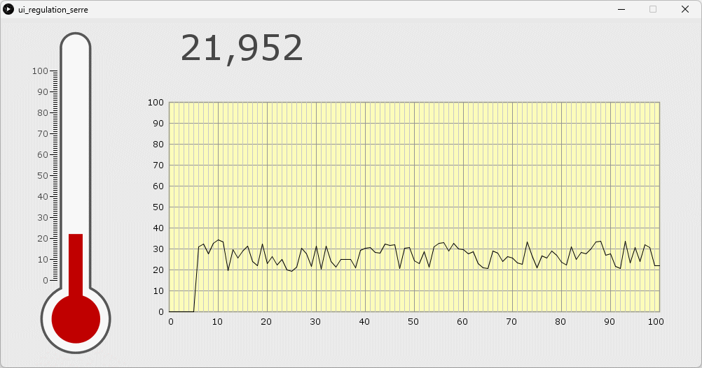
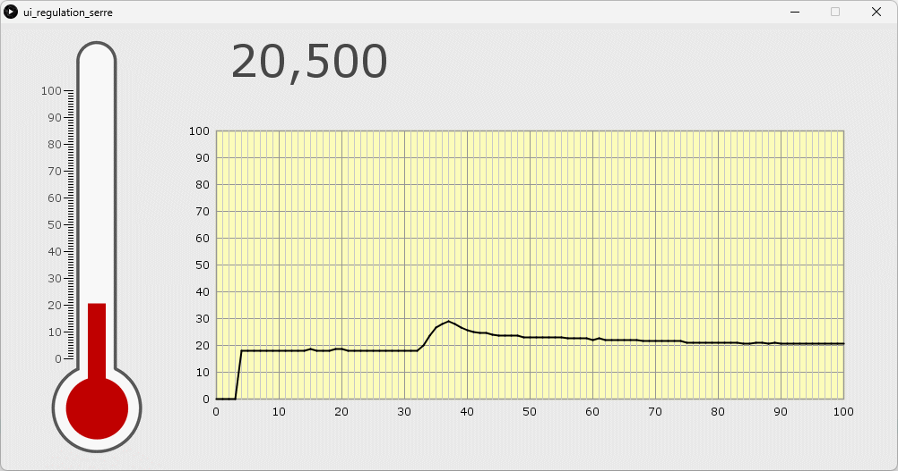

# Gestion d'une serre
Ceci est un mini-projet réalisé sur quelques semaines, pour prendre la main avec le C++ et les cartes Arduino ainsi que les fonctions de bases.

**Cahier des charges:**
> La serre doit disposer d'un système de chauffage, permettant de réguler la température intérieure en fonction de la température extérieure. En fonction, des plantes placées dans la serre, on pourra choisir la température de régulation avec un potentiomètre linéaire :
> - Pour les plantes tropicales la valeur max désirée est de 28°C à +/- 0.5°C
> - Pour les autres plantes la valeur min désirée est de 22°C à +/- 0.5°C
>
> Afin d'augmenter la productivité au début du printemps, on souhaite aussi réguler la lumière à l'intérieur de la serre. Un éclairage artificiel sera donc mis en fonctionnement si l'intensité lumineuse extérieure devient inférieure à 500 lux (+/- 50 lux). La mise en route ou l'arrêt du système de gestion de la serre doit se faire à partir de l'appui sur deux boutons poussoirs.

## Câblage
Le schéma de câble n'étant pas disponible, vous devrez le reproduire à l'aide du [programme](#programmes).

## Programmes
Dans [`regulation_serre.ino`](./regulation_serre/regulation_serre.ino), il y a toute la logique pour la gestion de la serre.

Et dans [`ui_regulation_serre`](./ui_regulation_serre/), faite en [Processing](https://processing.org/), il y a le programme qui permet de visualiser les données du thermomètre de la carte Arduino, comme montré ci-dessous.

Données d'exemple

Données réelles