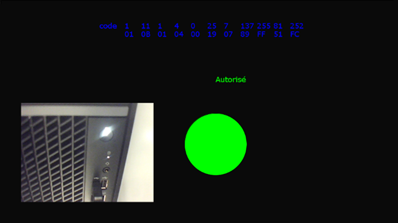

# Sécurité des zoos
Ceci est le second mini-projet réalisé dans l'année pour prendre mieux en main Processing et les liaisons séries [RS-232](https://fr.wikipedia.org/wiki/RS-232).

## Mise en service
Pour mettre en service le système, branchez un lecteur de carte RFID à l’ordinateur et alimentez-le de 7 volts, branchez également une carte Arduino avec un Shield relais, connectez le moteur à la broche COM3 et à la broche COM4 du Shield relais comme affiché ci-dessous, et alimentez le moteur de 5 volts aux bornes plus (+) et moins (-).

## Programmes
Ce mini-projet contient 2 programmes:
- [lecture_code.pde](./lecture_code/lecture_code.pde) - Le programme Processing qui va traiter les informations lues du lecteur RFID et qui enverra (ou non) le bit d'action à la carte Arduino.
- [moteur.ino](./moteur/moteur.ino) - Le programme téléversé dans la carte Arduino, qui fera tourner le moteur seulement lorsque le bit `9` est reçu, le moteur tourne selon les conditions définies par le cahier des charges.

