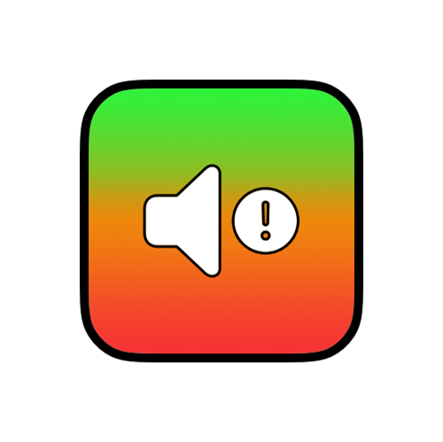

# Soundfest

Projet réalisé en fin d'année de première STI2D pour l'oral d'IT. Pour voir un aperçu du projet, rouvrez le diaporama `Presentation_Soundfest.pptx`.

Le programme est `micro.ino` réalisé sur une Arduino avec les composants listé dans le diaporama ci-dessus. Le programme peut sembler très mauvais, puisque c'est ma première fois avec du C++/Arduino